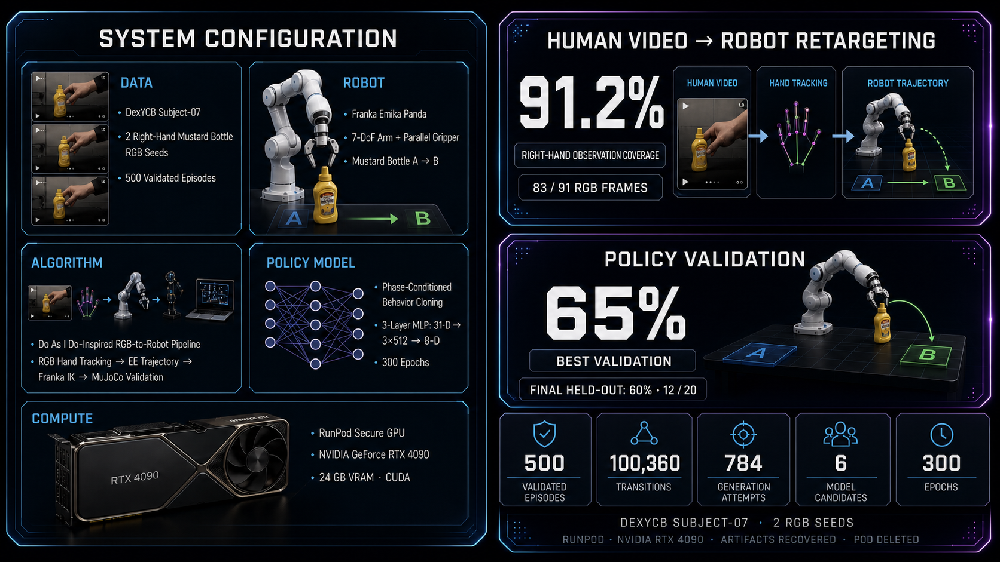

# Dataminer



**Human task video → validated robot training data.** A customer specifies a robot and task; Dataminer turns a fixed-camera demonstration into robot joint trajectories, checks the task in MuJoCo, and generates episodes for policy training. This prototype uses a **Franka Panda** to move a mustard bottle from A to B.

## What we demonstrated

| Stage | Measured result |
| --- | --- |
| RGB reconstruction | Right hand observed in **83/91 frames (91.2%)** of the public test video; missing frames remain null. |
| Robot conversion | **91/91 valid Franka IK frames**; simulated pick-and-place succeeded with **0.38 mm** final target distance. |
| Data generation | **500 validated episodes** from 784 attempts using two DexYCB RGB seeds plus generated carry/place/release segments. |
| Policy training | RunPod RTX 4090; six 300-epoch candidates; **65% best validation**, then **12/20 successes (60%)** on a separate held-out evaluation. |

The 91.2% figure is frame observation coverage, not robot task success. The 65% validation score and 60% final held-out score are different evaluations. We include both a [successful rollout](presentation/video_demo/02_demo2_success_rollout.mp4) and a [failed rollout](presentation/video_demo/03_demo2_failure_rollout.mp4).

## How it works

```text
RGB video → MediaPipe hand observations → end-effector path
→ Franka 7-joint IK → MuJoCo physics check → validated episodes
→ phase-conditioned behavior cloning on RunPod
```

Four real [Reflex Agent sessions](presentation/results/reflex_4_agent_job/README.md) ran reconstruction, retargeting, physical validation, and data scaling in separate Runloop Devboxes. Their [inputs, outputs, and checks](presentation/results/reflex_4_agent_job/run_summary.json) were recovered. Automatic transfer between Devboxes is not implemented yet; downstream agents regenerated their prerequisites from the same video.

## See it or run it

- [Presentation](presentation/index.html) · [Three demo videos](presentation/video_demo/) · [RunPod results](presentation/results/runpod_summary.json)
- [Pipeline code](dataminer/) · [RunPod training workflow](runpod_workflow_train/) · [Agent definitions](persona/) · [Project notes](document/)

To run the one-video pipeline after installing its dependencies:

```bash
python -m dataminer data/demo2/do_as_i_do_pick_place_preview.mp4 \
  --config dataminer/config/demo_config.json \
  --output-dir artifacts/dataminer_demo \
  --grasp-frame 30 --release-frame 70
```

The public video is a reproducible test input, not a newly recorded demonstration. DexYCB data is used for research/demo under CC BY-NC 4.0; [source and license notes](data/demo2/manifest.md) are included. Real-robot deployment needs camera calibration and robot-specific safety validation. API keys stay in a local `.env`; only [`.env.example`](.env.example) is tracked.
