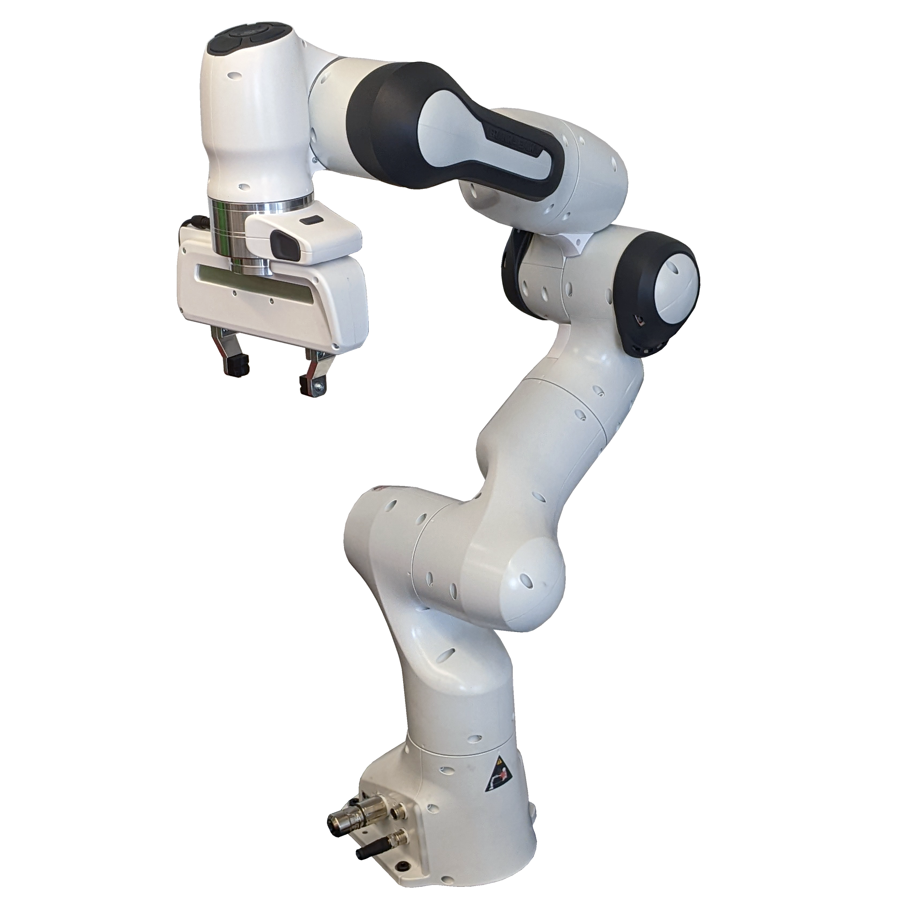

# 데모 로봇: Franka Emika Panda

## 선택 이유

- 7축 로봇팔과 평행 그리퍼를 사용해 컵 pick-and-place에 적합하다.
- PyBullet에 공개 URDF가 포함되어 있어 IK와 시뮬레이션을 빠르게 구현할 수 있다.
- 실제 로봇 학습 데이터와 연구 사례가 많아 출력 데이터의 검증이 쉽다.
- DROID 데이터셋이 같은 로봇으로 수집되어 기존 trajectory 형식을 참고할 수 있다.

## 실제 사용 분야

- 물체 집기, 이동, 정렬 및 조립 연구
- 모방학습과 강화학습 연구
- 텔레옵 기반 로봇 데이터 수집
- 비전 기반 로봇 조작과 인간-로봇 협업 연구

## 데모 설정

- 태스크: 컵을 A 지점에서 B 지점으로 옮기기
- 입력: 사람이 같은 태스크를 수행하는 영상
- 출력: 7개 관절의 시간별 각도와 gripper 상태
- 검증: PyBullet에서 trajectory 재생 및 충돌·관절 제한·태스크 성공 여부 확인

## 참고 자료

- [Franka Research 3 공식 정보](https://franka.de/franka-research-3)
- [PyBullet Franka Panda URDF](https://github.com/bulletphysics/bullet3/blob/master/examples/pybullet/gym/pybullet_data/franka_panda/panda.urdf)
- [DROID 데이터셋](https://droid-dataset.github.io/)
- [이미지 출처: Cornell EmPRISE Lab](https://emprise.cs.cornell.edu/people/)
